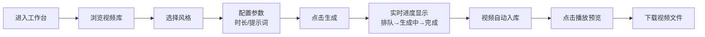

## 1. 产品概述

Agnes AI 视频生成工作台是一个基于 Web 的可视化视频创作平台，用户可以通过直观的界面选择风格、生成视频、在线预览和下载。结合 ai-shortfilm-prompts 的 5段式电影级提示词方法论，让普通用户也能轻松创作出具有电影质感的 AI 视频。

- **目标用户**：内容创作者、短视频制作者、AI 艺术爱好者
- **核心价值**：将复杂的提示词工程封装为可视化风格选择，一键生成电影级视频

## 2. 核心功能

### 2.1 功能模块

1. **视频库首页**：已生成视频展示、网格布局、悬浮预览
2. **风格选择器**：8种预设风格卡片、风格预览图、动态效果描述
3. **视频生成器**：参数配置（时长、提示词）、实时进度条、生成状态
4. **视频播放器**：高清播放、下载按钮、分享链接、生成详情

### 2.2 页面详情

| 页面名称 | 模块名称 | 功能描述 |
|-----------|-------------|---------------------|
| 工作台首页 | 顶部导航 | Logo、风格切换、生成按钮 |
| 工作台首页 | 视频库网格 | 视频卡片悬浮播放、下载按钮、状态标签 |
| 工作台首页 | 生成面板 | 风格选择器、时长设置、自定义提示词、生成按钮 |
| 视频详情 | 播放器 | 大尺寸视频播放、进度条、全屏 |
| 视频详情 | 信息栏 | 风格名称、生成时间、文件大小、下载按钮 |

## 3. 核心流程

用户进入工作台后，可以浏览已生成的视频库，选择喜欢的风格并配置参数，一键发起视频生成。生成过程中实时显示进度，完成后视频自动加入视频库，用户可在线播放或下载到本地。

## 4. 用户界面设计

### 4.1 设计风格

- **主色调**：深色科技风，深紫蓝渐变背景（#0f0a1e → #1a1033），霓虹青色作为强调色（#00f5ff）
- **辅助色**：霓虹紫（#a855f7）、暖金（#fbbf24）用于状态标识
- **按钮风格**：玻璃拟态（Glassmorphism），圆角 16px，发光边框 hover 效果
- **字体**：展示字体使用 Space Grotesk，正文字体使用 Inter，等宽字体使用 JetBrains Mono
- **布局风格**：卡片式网格布局，卡片悬浮发光效果，毛玻璃导航栏
- **视觉效果**：渐变网格背景、噪点叠加、光晕效果、流畅过渡动画

### 4.2 页面设计概览

| 页面名称 | 模块名称 | UI 元素 |
|-----------|-------------|-------------|
| 工作台首页 | 顶部导航 | 毛玻璃效果、Logo发光、导航链接下划线动画 |
| 工作台首页 | Hero 区域 | 大标题渐变文字、副标题、CTA 按钮发光效果 |
| 工作台首页 | 风格选择器 | 卡片网格、悬浮放大、发光边框、风格名称渐变 |
| 工作台首页 | 视频库 | 响应式网格、悬浮播放、下载按钮、状态徽章 |
| 工作台首页 | 生成进度 | 进度条发光动画、状态文字渐变、百分比数字 |
| 视频详情 | 播放器 | 大尺寸播放区域、自定义控制条、下载按钮 |

### 4.3 响应式

- **桌面端**（1280px+）：4列视频网格，左右分栏布局
- **平板端**（768px-1279px）：2-3列网格，上下堆叠布局
- **移动端**（<768px）：单列布局，底部导航，触摸优化的按钮尺寸

### 4.4 动效设计

- 页面加载：元素错落入场动画（staggered reveal）
- 卡片悬浮：轻微放大 + 发光边框 + 背景光晕
- 生成进度：脉冲发光效果 + 流动渐变条纹
- 视频播放：淡入过渡，控制条悬浮显示
- 按钮点击：缩放反馈 + 波纹效果
