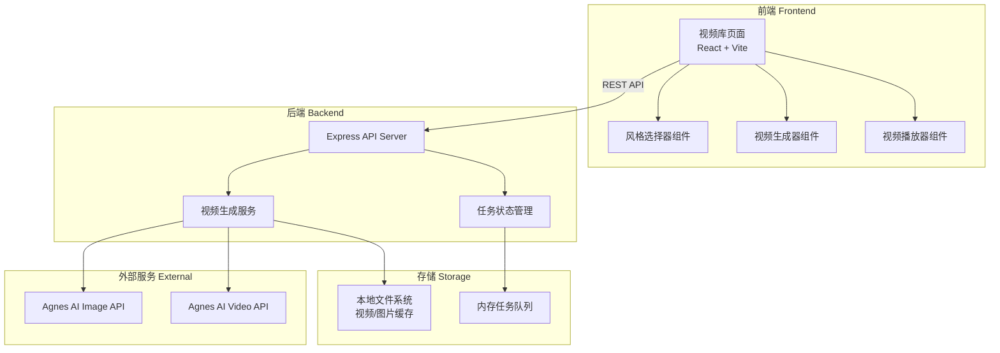
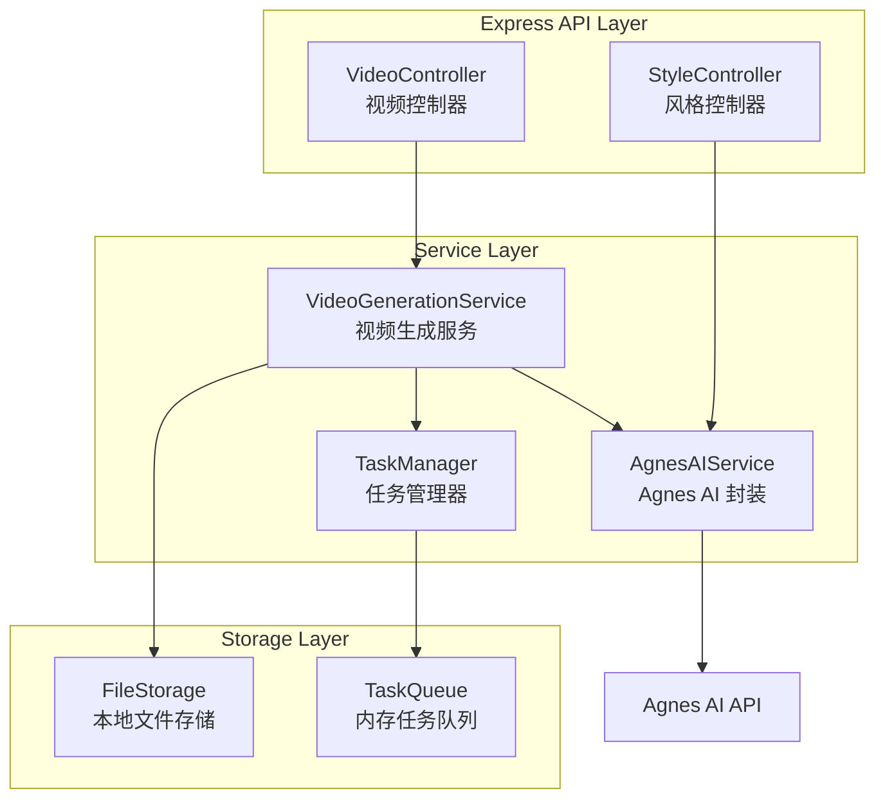

## 1. 架构设计



## 2. 技术描述

- **前端**：React 18 + Vite 5 + TailwindCSS 3 + Framer Motion（动画）
- **初始化工具**：Vite 5.x
- **后端**：Express 4.x（Node.js）
- **HTTP 客户端**：Axios（调用 Agnes AI API）
- **数据库/存储**：本地文件系统 + 内存任务队列（轻量级，无需数据库）
- **UI 组件库**：自定义组件 + Lucide React 图标

### 选型理由

1. **React + Vite**：快速开发，热更新体验好，组件化适合视频卡片等重复元素
2. **TailwindCSS**：快速实现深色科技风、玻璃拟态等视觉效果
3. **Framer Motion**：实现卡片悬浮、进度条发光、页面入场等高级动效
4. **Express**：轻量后端，快速搭建 REST API，对接 Agnes AI
5. **本地文件存储**：简单直接，视频文件直接保存到服务器本地

## 3. 路由定义

| 路由 | 页面/用途 |
|-------|---------|
| `/` | 工作台首页（视频库 + 风格选择 + 生成面板） |
| `/video/:id` | 视频详情播放页 |

## 4. API 定义

### 4.1 获取视频列表

```typescript
GET /api/videos

Response:
{
  videos: Array<{
    id: string;
    style: string;
    styleName: string;
    status: 'pending' | 'processing' | 'completed' | 'failed';
    progress: number;
    imageUrl?: string;
    videoUrl?: string;
    duration: number;
    size: string;
    createdAt: string;
    prompt: string;
  }>
}
```

### 4.2 获取单个视频详情

```typescript
GET /api/videos/:id

Response:
{
  id: string;
  style: string;
  styleName: string;
  status: 'pending' | 'processing' | 'completed' | 'failed';
  progress: number;
  imageUrl?: string;
  videoUrl?: string;
  localVideoPath?: string;
  duration: number;
  size: string;
  createdAt: string;
  prompt: string;
  motionPrompt: string;
}
```

### 4.3 获取风格列表

```typescript
GET /api/styles

Response:
{
  styles: Array<{
    id: string;
    name: string;
    description: string;
    imagePrompt: string;
    videoPrompt: string;
    imageSize: string;
    defaultSeconds: number;
  }>
}
```

### 4.4 创建视频生成任务

```typescript
POST /api/videos/generate

Request:
{
  styleId: string;        // 风格ID
  seconds?: number;       // 视频时长，默认5秒
  customPrompt?: string;  // 自定义提示词，可选
}

Response:
{
  id: string;
  status: 'pending';
  style: string;
  styleName: string;
  createdAt: string;
}
```

### 4.5 查询任务状态

```typescript
GET /api/videos/:id/status

Response:
{
  id: string;
  status: 'pending' | 'processing' | 'completed' | 'failed';
  progress: number;
  videoUrl?: string;
  error?: string;
}
```

### 4.6 图生视频（直接上传图片URL）

```typescript
POST /api/videos/image-to-video

Request:
{
  imageUrl: string;       // 图片URL
  motionPrompt: string;   // 动态描述
  seconds?: number;       // 时长
}

Response:
{
  id: string;
  status: 'pending';
  createdAt: string;
}
```

## 5. 服务端架构图



## 6. 数据模型

### 6.1 视频任务 (VideoTask)

| 字段 | 类型 | 说明 |
|------|------|------|
| id | string | 任务唯一ID |
| style | string | 风格ID |
| styleName | string | 风格名称 |
| status | enum | pending/processing/completed/failed |
| progress | number | 进度百分比 0-100 |
| prompt | string | 图片提示词 |
| motionPrompt | string | 视频动态提示词 |
| imageUrl | string | 参考图URL |
| videoUrl | string | 生成的视频URL |
| localImagePath | string | 本地图片路径 |
| localVideoPath | string | 本地视频路径 |
| duration | number | 视频时长（秒） |
| size | string | 文件大小（可读格式） |
| createdAt | Date | 创建时间 |
| completedAt | Date | 完成时间 |
| error | string | 错误信息（失败时） |

### 6.2 风格预设 (StylePreset)

| 字段 | 类型 | 说明 |
|------|------|------|
| id | string | 风格唯一ID |
| name | string | 风格名称 |
| description | string | 风格描述 |
| imagePrompt | string | 图片生成提示词 |
| videoPrompt | string | 视频动态提示词 |
| imageSize | string | 图片尺寸（如 1024x576） |
| defaultSeconds | number | 默认视频时长 |
