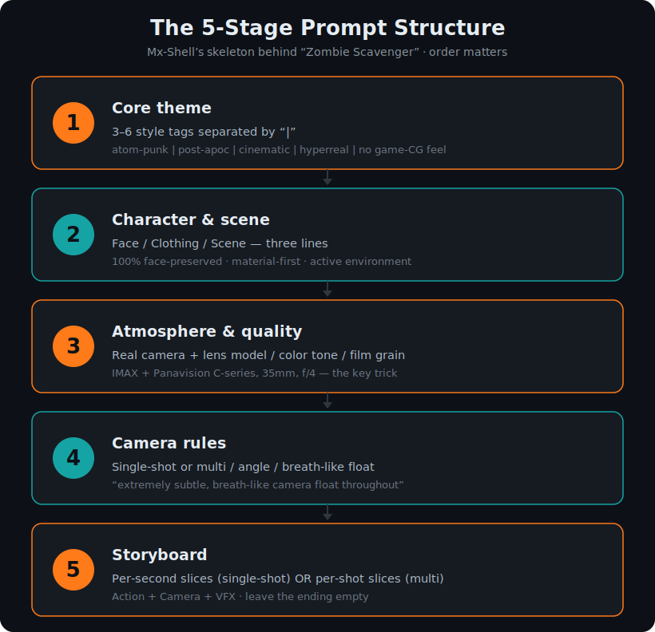

# ai-shortfilm-prompts

<!-- ════════════════════════════════════════════════════════════════════
     README HERO DEMO — drop in the 15s clip here.
     The clip is generated from ./assets/demo-prompt.md (written by the Skill).

     To enable, produce the clip in Seedance, then EITHER:

     (A) mp4 — drag demo.mp4 into any GitHub issue/PR comment, copy the
         generated https://user-images.githubusercontent.com/... URL,
         then uncomment and paste it here:
     <p align="center">
       <video src="PASTE_GITHUB_VIDEO_URL_HERE" width="720" autoplay loop muted playsinline></video>
       <br><sub>▶ 15s demo — generated from a prompt this repo's Skill wrote (<a href="./assets/demo-prompt.md">prompt</a>)</sub>
     </p>

     (B) gif — commit assets/demo.gif, then uncomment:
     <p align="center">
       
       <br><sub>▶ 15s demo — generated from a prompt this repo's Skill wrote (<a href="./assets/demo-prompt.md">prompt</a>)</sub>
     </p>
════════════════════════════════════════════════════════════════════ -->

[](./LICENSE)
[](https://github.com/jnMetaCode/ai-shortfilm-prompts)
[](https://x.com/aibuzhiyu/status/2056426660577288645)
[](#install-claude-code)

> The complete methodology + prompt library + Claude Code Skill behind
> **[*Zombie Scavenger*](https://x.com/aibuzhiyu/status/2056426660577288645)**
> by Mx-Shell — the AI short Hollywood director PJ Ace called
> *"one of the best short films I've seen in years."*

**[中文版 →](./README.zh.md)**

---

## 🎬 The tweet that started it all

> *"This is one of the best short films I've seen in years.*
> *Very soon, we'll stop calling it 'AI film' and just call it film."*
>
> *Film name: Zombie Scavenger by MX-Shell.*
>
> — **PJ Ace** ([@PJaccetturo](https://x.com/PJaccetturo)),
> [May 10, 2026](https://x.com/aibuzhiyu/status/2056426660577288645)

| 13.4M views | 82K likes | 7.4K reposts | 39K bookmarks | 2.3K replies |
|---|---|---|---|---|

<sub>Stats are from PJ Ace's original tweet ([@PJaccetturo](https://x.com/PJaccetturo), May 10, 2026), as of mid-May 2026.</sub>

This repository is **the complete workflow behind that film**, made
available because Mx-Shell himself published his prompt collection
documents and walked through his entire method on a public Douyin
livestream.

---

## ⚡ The single-line magic prompt (try it tonight)

Copy this into Sora / Seedance / Kling / Veo. Replace `{{...}}`:

```
Anamorphic widescreen cinematic. Simulated IMAX film camera +
Panavision C-series lens (35mm focal, f/4 aperture). Handheld
shot — extremely subtle, breath-like camera float throughout.
{{your scene description}}.
No score. Production audio only.
```

**Why this works**: real camera bodies + "breath-like float" anchor
the AI to actual film aesthetics — not the vague "cinematic feel"
keyword everyone else uses. Full breakdown in
[methodology.md](./methodology.md).

---

## ❌ vs ✅ — what the method actually changes

Same idea: *a female mech warrior raises an energy shield in a thunderstorm.*

**❌ The naive prompt** (what most people write):

```
Epic cinematic shot of a beautiful female mech warrior activating a
stunning energy shield in the rain. Highly detailed, 4K, photorealistic,
movie-quality, dramatic lighting.
```

Vague praise — *epic / stunning / 4K / movie-quality* — gives the model
nothing concrete to anchor to. You get generic game-CG output.

**✅ With the 5-stage method** (excerpt):

```
Core theme: gritty hard sci-fi mech | rainy dock | battle-damage aesthetic | energy shield | post-apocalyptic live-action
Atmosphere: simulated IMAX film camera + Panavision C-series (35mm, f/4). Low-saturation teal base, film grain.
Camera: handheld — extremely subtle, breath-like float throughout.
9–12s: hexagonal energy cells light up unevenly, some flicker as if faulty; rain bends around a 2m dome.
Ending: no dialogue, no light burst — just rain vaporizing on the shield, a lightning flash across the dock.
```

Real camera/lens names + physical reactions + battle damage + an empty
ending = visceral realism. Full sample with the 10-item self-check:
[examples/02-skill-output-sample.md](./.claude/skills/shortfilm-prompt/examples/02-skill-output-sample.md).

---

## The story

May 2026. A 29-year-old vocational-school graduate from rural Yunnan,
China — handle **Mx-Shell** — used **10 days** and ~20,000 RMB of
cloud credits to make a 3-minute AI short called *Zombie Scavenger*:
an atomic-punk robot wanders into a beachfront villa after a zombie
apocalypse, meets a confused ostrich, and starts dancing
1980s-style breakdance moves while kicking a zombie's head across
the floor.

Hollywood director **PJ Ace (@PJaccetturo)** retweeted the film,
calling it *"one of the best short films I've seen in years"* and started a
search for the author.

A few weeks later Mx-Shell went on a Douyin livestream and **gave
away his entire workflow** — the prompts, the camera language, the
failure modes, the reroll counts.

This repo is the result of digesting 130,000 characters of his
materials into a structured, reusable system.

---

## What's in here

```
ai-shortfilm-prompts/
├── README.md              You're here. English entry point.
├── README.zh.md           Chinese version.
├── methodology.md         The 5-stage prompt structure, explained.
├── methodology.zh.md      Chinese version.
├── faq.md                 Q&A: tools, failures, costs, edge cases.
├── faq.zh.md              Chinese version.
├── credits.md             Sources & attribution.
├── credits.zh.md          Chinese version.
├── LICENSE                MIT (this work)
├── NOTICE                 Attribution + Mx-Shell ARR details (dual-licensing)
│
├── prompts/                Mx-Shell's complete original prompts.
│                           Body kept in Chinese (his authorial
│                           voice), with English header on each file.
│   ├── README.md           Index of all prompt archives
│   ├── zombie-scavenger.md             *Zombie Scavenger*
│   ├── kamen-rider-transformations.md   Kamen Rider transformation × 5 variants
│   ├── kaisa-transformation.md       LoL Kai'Sa transformation × 3 versions
│   ├── pacific-rim-gundam.md         Pacific Rim + Gundam mech-drop
│   ├── cyber-wuxia.md                Shaw Brothers + steampunk wuxia template
│   └── metal-gear-charge-combat.md   Weapon-charge + combat composite
│
├── templates/              IP-stripped generalized templates (English).
│                           Authored by jnMetaCode based on Mx-Shell's structure.
│   ├── 15s-transformation.md         15-second transformation
│   ├── multi-shot-narrative.md       Multi-shot edited narrative
│   └── atmosphere-prefabs.md         8 reusable atmosphere/look prefabs
│   ├── *.zh.md             Chinese versions of the above
│
├── .claude/skills/shortfilm-prompt/   Claude Code Skill
│   ├── SKILL.md            How Claude should generate prompts (7 hard rules + 10-item checklist)
│   ├── TESTING.md          How to run rigorous skill tests in another Claude window
│   └── examples/           5 test cases with expected outputs
│
└── .claude-plugin/         Plugin metadata (plugin.json + marketplace.json)
```

---

## TL;DR — The 5-stage prompt structure

<p align="center">
  
</p>

Every Mx-Shell video prompt follows the same skeleton. The order matters:

```
1. Core theme            ← 3-6 style tags separated by |
2. Character & scene     ← Face / clothing / environment
3. Atmosphere & quality  ← Visual base / color tone / style core
4. Camera rules          ← Single-shot or multi-shot / angle / breathing
5. Storyboard            ← Per-second OR per-shot breakdown
```

### Three counter-intuitive rules

1. **Specify real camera + lens models.**
   Don't write *"cinematic feel"*. Write
   *"simulated IMAX film camera, Panavision C-series lens, 35mm focal,
   f/4 aperture."* AI training data binds those exact strings to real
   movie aesthetics.

2. **Describe imperfections.**
   *"Battle-damaged armor, paint worn off, oil in the joints, minor
   facial blemishes preserved."* Perfection looks fake. The visceral
   realism comes from the flaws.

3. **Leave the ending empty.**
   *"No dialogue. No explosion. No blinding light.
   Just a figure standing in the smoke, a meteor crossing the sky."*

Full methodology in [methodology.md](./methodology.md).

---

## Install (Claude Code)

### Option 1 — Plugin Marketplace ⭐ (one-line install)

```
/plugin marketplace add jnMetaCode/ai-shortfilm-prompts
/plugin install ai-shortfilm-prompts@ai-shortfilm-prompts
```

Then in Claude Code:

```
/ai-shortfilm-prompts:shortfilm-prompt  Help me write a 15-second prompt for a
                                        robot transformation, green color palette,
                                        energy core in the belt buckle,
                                        post-apocalyptic jungle background
```

### Option 2 — Try it inside this repo

```bash
git clone https://github.com/jnMetaCode/ai-shortfilm-prompts.git
cd ai-shortfilm-prompts
claude   # then type /shortfilm-prompt
```

### Option 3 — Make it available globally (manual copy)

```bash
mkdir -p ~/.claude/skills
cp -r ai-shortfilm-prompts/.claude/skills/shortfilm-prompt \
      ~/.claude/skills/
```

### Option 4 — As a submodule in your own project

```bash
git submodule add https://github.com/jnMetaCode/ai-shortfilm-prompts.git \
                  .claude/skills/_shortfilm
```

The Skill walks through the 5-stage structure, runs a 10-item self-check,
and warns you about IP names that may be blocked by Seedance 2.0.

---

## Compatible video models

The 5-stage structure is **model-agnostic**. Verified to work well with:

| Model | Notes |
|---|---|
| Seedance 2.0 (Doubao Xiaoyunque, 沉浸式短片) | Mx-Shell's primary engine. **Avoid the "Fast" variant** — quality drops. Strict IP-name filter. |
| Sora | Prefers concise prompts. Keep 5 stages but trim per-section length. |
| Kling (可灵) | More permissive on IP names. Needs *more* explicit motion description. |
| Jimeng (即梦) | Strong 3D feel — emphasize "no game-CG feel" extra hard. |
| Veo | Works well; English prompts preferred. |

---

## Sister projects (by the same author)

This is the video-prompt sibling of the AI-coding ecosystem maintained
by [@jnMetaCode](https://github.com/jnMetaCode):

- [superpowers-zh](https://github.com/jnMetaCode/superpowers-zh) — Chinese-enhanced edition of `obra/superpowers` (TDD / debug / git workflow skills)
- [agency-agents-zh](https://github.com/jnMetaCode/agency-agents-zh) — 211 plug-and-play AI expert personas
- [agency-orchestrator](https://github.com/jnMetaCode/agency-orchestrator) — Multi-agent collaboration orchestrator
- [ai-coding-guide](https://github.com/jnMetaCode/ai-coding-guide) — 66 Claude Code tips
- [shellward](https://github.com/jnMetaCode/shellward) — AI Agent security middleware
- [ai-coding-trilogy](https://github.com/jnMetaCode/ai-coding-trilogy) — AI coding three-volume book

All projects share the same `SKILL.md` format. The video skill stacks
freely with any of them.

---

## Contributing

The roadmap is to collect more AI-shortfilm creators' methods, structured the
same way. New prompts, templates, fixes, and translations are welcome — see
[CONTRIBUTING.md](./CONTRIBUTING.md) for the submission template and rules
(public source required, credit the original creator).

Made something with the method? It goes on the [showcase](./showcase.md).

---

## License

**[MIT License](./LICENSE)** for everything authored by jnMetaCode
(methodology, FAQ, templates, Skill, metadata). Free for any use
including commercial — just keep the copyright notice.

Mx-Shell's original prompts and document excerpts — sourced from his
fan-group documents and public Douyin livestream that he himself
distributed — remain **© Mx-Shell, all rights reserved**. Archived here
for educational reference; commercial use requires contacting Mx-Shell
directly. Full dual-licensing details: [NOTICE](./NOTICE) ·
attribution: [credits.md](./credits.md).

---

## A line worth remembering

> *"For creation, the equipment is not what matters.
> The idea is what matters."*
> — Mx-Shell, May 12, 2026 livestream
