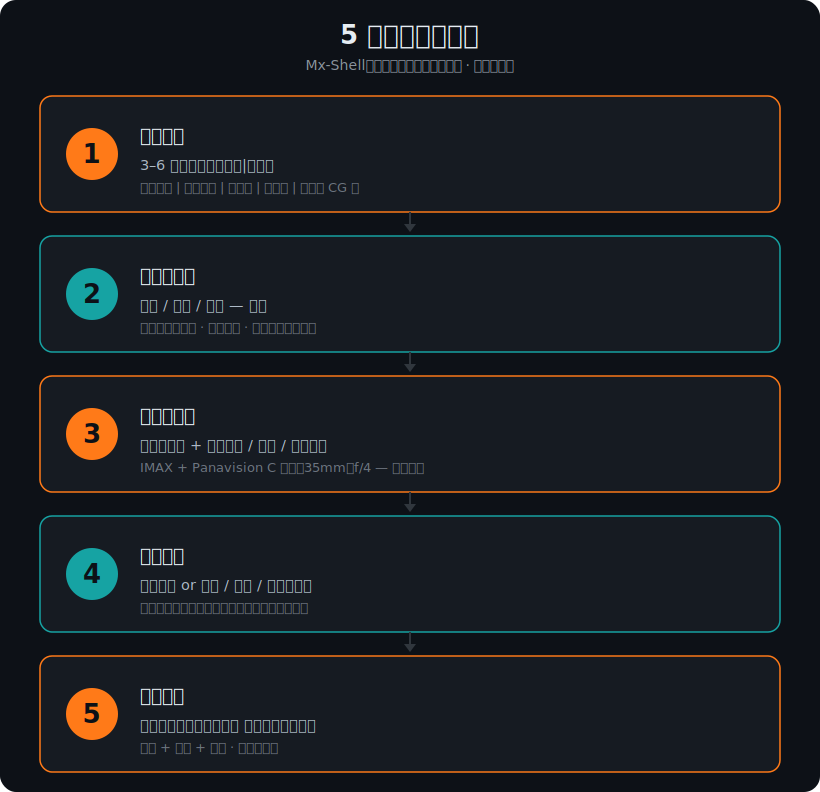

# ai-shortfilm-prompts · AI 短片提示词方法论


<!-- aiolaola:start -->
> 📖 **免费配套学习** · [aiOlaOla — 从零学会 AI 编程 →](https://aiolaola.com/?utm_source=github&utm_campaign=shortfilm)
> 180 节免费实操课 + 《AI 编程实战三卷书》在线读 + 实战社区 + AI 助教 · **永久免费,登录即学。**
>
> 🌟 **姐妹项目**:[agency-orchestrator ⭐1.4k](https://github.com/jnMetaCode/agency-orchestrator) · [agency-agents-zh ⭐15.2k](https://github.com/jnMetaCode/agency-agents-zh) · [superpowers-zh ⭐5.6k](https://github.com/jnMetaCode/superpowers-zh) · [ai-coding-trilogy](https://github.com/jnMetaCode/ai-coding-trilogy) · [ai-coding-guide ⭐405](https://github.com/jnMetaCode/ai-coding-guide)
<!-- aiolaola:end -->

<!-- ═══ 顶部 demo 片位 —— 出片后两步发布：
     1. 把你的 demo.mp4 拖进任意 GitHub issue/PR 评论框，复制它生成的
        https://user-images.githubusercontent.com/... 链接。
     2. 在下面这个块里，去掉外面的注释符，把 PASTE_VIDEO_URL_HERE 换成那个链接。
     生成这条片的提示词：./assets/demo-prompt.md
     （想用 gif？把 video 那行换成：） ═══ -->
<!--
<p align="center">
  <video src="PASTE_VIDEO_URL_HERE" width="720" autoplay loop muted playsinline></video>
  <br><sub>▶ 15 秒 demo —— 由本仓库 Skill 写的提示词生成（<a href="./assets/demo-prompt.md">提示词</a>）</sub>
</p>
-->

[](./LICENSE)
[](https://github.com/jnMetaCode/ai-shortfilm-prompts)
[](https://x.com/aibuzhiyu/status/2056426660577288645)
[](#安装claude-code-用户)

> AI 短片提示词写作的开源方法库 + 案例集 + Claude Code Skill。
> 首发版本基于 Mx-Shell《丧尸清道夫》(Zombie Scavenger) 拆解 ——
> **让好莱坞导演 PJ Ace 评为"近年来最佳短片之一"** 的作品。
> 后续计划收录更多 AI 短片创作者的方法。

> ⚡ **快速上手：** [一页速查表](./cheatsheet.zh.md) ·
> [翻车→修正案例集](./cases.zh.md)

---

## 🎬 PJ Ace 那条引爆的推文

> *"这是我近年来看过最好的短片之一。"*
> *"很快，我们将不再称其为'AI 电影'，而直接称其为电影。"*
>
> *Film name: Zombie Scavenger by MX-Shell.*
>
> —— **PJ Ace** ([@PJaccetturo](https://x.com/PJaccetturo))
> [2026 年 5 月 10 日](https://x.com/aibuzhiyu/status/2056426660577288645)

| 1340 万 浏览 | 82K 点赞 | 7.4K 转发 | 39K 收藏 | 2.3K 评论 |
|---|---|---|---|---|

<sub>数据来自 PJ Ace 的原始推文（[@PJaccetturo](https://x.com/PJaccetturo)，2026 年 5 月 10 日），统计于 2026 年 5 月中旬。</sub>

本仓库是这部短片背后**完整的工作流** —— Mx-Shell 自己在粉丝群分享了提示词文档，又在抖音直播完整讲了他的方法论。我们做的是结构化整理。

---

## ⚡ 今晚就能抄的一句话

复制到 Sora / Seedance / 可灵 / 即梦 / Veo，替换 `{{...}}`：

```
变形宽荧幕电影质感。模拟 IMAX 胶片摄影机 + Panavision C 系列镜头
（焦段 35mm，光圈 f4）。手持拍摄，全程保持极其轻微的、如呼吸般的镜头浮动。
{{你的场景描述}}。
不需要配乐，仅保留同期声。
```

**为什么管用**：写具体摄影机型号 + "呼吸感"运镜，能把 AI 锚定到真电影美学；"电影感"这种空泛词没用。完整拆解见 [方法论](./methodology.zh.md)。

---

## 5 段式结构一览

<p align="center">
  
</p>

每条 Mx-Shell 的视频提示词都是这套骨架，**顺序很重要**。完整讲解见 [方法论](./methodology.zh.md)。

---

## ❌ vs ✅ —— 这套方法到底改了什么

同一个想法：*女机甲战士在暴雨雷暴中开启能量护盾。*

**❌ 大多数人写的：**

```
史诗级电影感镜头，一个漂亮的女机甲战士在雨中开启震撼的能量护盾。
高细节，4K，照片级真实，电影质感，戏剧化灯光。
```

"史诗 / 震撼 / 4K / 电影质感"这种空泛词，AI 抓不到任何具体锚点 —— 产出的就是泛泛的游戏 CG 感。

**✅ 用 5 段式方法（节选）：**

```
核心主题：写实硬核机甲 | 雷雨码头 | 战损美学 | 能量护盾 | 末日真人演绎
氛围画质：模拟 IMAX 胶片摄影机 + Panavision C 系列（35mm，f/4）。低饱和青绿主调，胶片颗粒。
运镜：手持，全程极其轻微、如呼吸般的浮动。
9–12 秒：六边形能量单元逐格亮起、覆盖不均，部分如故障般闪烁；雨水沿 2 米伞状能量场绕开。
结尾：没有台词、没有炫光 —— 只有雨水打在护盾上汽化，远处一道闪电照亮码头。
```

真实摄影机/镜头型号 + 物理反馈 + 战损细节 + 留白结尾 = 那种"真"的质感。完整样本（含 10 条自检）见 [examples/02-skill-output-sample.md](./skills/shortfilm-prompt/examples/02-skill-output-sample.md)。

---

## 故事

2026 年 5 月，**Mx-Shell**（云南玉溪人，中专学历，29 岁，已成家，摄影副业）用 **10 天** 做出 3 分钟 AI 短片《丧尸清道夫》：原子朋克机器人在末日丧尸危机后的滨海别墅，与一只呆鸵鸟相遇，跳着 1980 年代标志性舞蹈风格的霹雳舞，踢飞丧尸头颅。

> 关于"3000 元成本"：网传的口径来自 Mx-Shell 本人，但他在直播里被追问时又改口为"几万 / 两万多块钱"。真实开销大概率比 3000 元高，但仍然远低于真人拍摄的同等时长短片。第一部 AI 作品是给姐姐家的云南玉溪新平希尔顿酒店做的（2026 年 1 月）。

短片被好莱坞导演 **PJ Ace** 评为"近年来最佳短片之一"并全网寻找原作者。
他事后开了两次直播，把自己写提示词的思路全部讲出来，还把当初的文档分享给了粉丝。

**这个仓库是把那些原始材料整理、归纳、结构化，让你能学到他写提示词的方法。**

不是教你复刻这部片子。是教你写出能做出**自己作品**的提示词。

---

## 这里有什么

```
ai-shortfilm-prompts/
├── README.md / README.zh.md         ← 你在看的这一份（中英双语）
├── cheatsheet.md / .zh.md           ← 一页速查表（整套方法一眼看完）
├── cases.md / .zh.md                ← 翻车→修正案例集（常见烂输出与改法）
├── methodology.md / .zh.md          ← Mx-Shell 的 5 段式提示词模板讲解 ⭐
├── faq.md / .zh.md                  ← 整合的 17 条 + 直播 Q&A
├── credits.md / .zh.md              ← 来源与致谢
├── showcase.md                      ← 用这套方法做出来的作品
├── CONTRIBUTING.md                  ← 投稿模板与规则
├── LICENSE                          ← MIT（本仓库整理内容）
├── NOTICE / NOTICE.zh               ← 署名 + Mx-Shell 原作版权说明（双授权）
│
├── prompts/                         ← Mx-Shell 公开过的完整原始提示词
│   ├── README.md                    ← 索引
│   ├── index.json                   ← 机器可读的提示词索引
│   ├── zombie-scavenger.md          ← 标志作《丧尸清道夫》
│   ├── kamen-rider-transformations.md  ← 假面骑士变身 × 6（5 骑士 + 飞行版）
│   ├── kaisa-transformation.md      ← LOL 卡莎变身 × 3 版本
│   ├── pacific-rim-gundam.md        ← 环太平洋 + 高达跳机
│   ├── cyber-wuxia.md               ← 邵氏 + 蒸汽朋克江湖模板
│   └── metal-gear-charge-combat.md  ← 武器充能 + 打斗复合段
│
├── templates/                       ← 去掉 IP 的通用骨架（中英双语）
│   ├── 15s-transformation.md        ← 15 秒变身
│   ├── multi-shot-narrative.md      ← 多分镜叙事
│   ├── atmosphere-prefabs.md        ← 8 个可复用氛围/画质骨架
│   ├── negative-prompts.md          ← 负向提示词预制件（按模型）
│   ├── genre-camera-sop.md          ← 五大类型片运镜 SOP
│   ├── camera-move-library.md       ← 五大技法模块 50 式运镜库
│   ├── pet-lifetime-narrative.md    ← 实战范例：萌宠亲情情感叙事
│   ├── family-recipe-farewell.md    ← 实战范例：妈妈的菜谱·传承
│   └── elderly-cat-companion.md     ← 实战范例：奶奶与猫·留守陪伴
│
├── assets/                          ← 图示 + README 顶部 demo 提示词
│   ├── demo-prompt.md               ← Skill 写的可复制 15 秒提示词（顶部片位）
│   └── 5-stage-structure.svg        ← 5 段式结构图
│
├── skills/shortfilm-prompt/ ← Claude Code Skill
│   ├── SKILL.md                     ← /shortfilm-prompt 调用后自动生成提示词
│   ├── TESTING.md                   ← 如何在另一个 Claude 窗口做严格测试
│   └── examples/                    ← 4 个测试用例（5 个文件）+ 期望输出
│
└── .claude-plugin/                  ← plugin 元数据（plugin.json + marketplace.json）
```

> 原始 docx、直播录像、视频截图等版权敏感素材未上传 GitHub（保留在本地），仓库只收录整理后的纯文档。

---

## 怎么读

**如果你只有 10 分钟** → 读 [方法论](./methodology.zh.md)。
那里讲了 Mx-Shell 反复使用的 5 段式结构，看完你大概就能开始自己写。

**如果你想自己做一部变身/丧尸/MV 短片**：
1. 先看 [方法论](./methodology.zh.md) 理解结构
2. 翻 [原始提示词](./prompts/) 找一个最接近你想做的作品
3. 翻 [模板](./templates/) 找一份去 IP 的骨架，填上自己的设定
4. 翻 [实战 FAQ](./faq.zh.md) 看遇到具体问题怎么处理

**如果你用 Claude Code**：
把 `skills/shortfilm-prompt/` 拷到你的工作目录（或 `~/.claude/skills/` 全局可用），然后输入 `/shortfilm-prompt` —— Skill 会问你几个问题然后帮你写提示词。

---

## 这套方法论是为谁写的

- **写过提示词，但效果一直不稳定**的人 —— 这里有结构化的写法。
- **想做 AI 短片，但不知道从哪开始**的人 —— 直接套用模板就行。
- **被"AI 生成视频质量差"劝退**过的人 —— 90% 的问题不是模型不行，是提示词没写对。

---

## 这套方法论**不是**

- 一键复制粘贴的咒语 —— Mx-Shell 自己也说"用同样的提示词生成两次都会差很多"。AI 是抽卡。
- 通用万灵药 —— 这套方法主要为 **Seedance 2.0 / 小云雀 沉浸式短片**优化。其他模型（Sora / 可灵 / 即梦）思路通用，具体词汇可能要调。
- 完整教程 —— 没讲剪辑、调色、配乐、后期。建议自学剪映 + 找 Artlist 等版权音乐网站。

---

## 安装（Claude Code 用户）

四种方式任选，推荐方式 1。

**方式 1：Plugin Marketplace** ⭐（一行装好，推荐）
```
/plugin marketplace add jnMetaCode/ai-shortfilm-prompts
/plugin install ai-shortfilm-prompts@ai-shortfilm-prompts
```
然后输入 `/ai-shortfilm-prompts:shortfilm-prompt` 即可调用 Skill。

**方式 2：项目内引用**（适合先试用）
```bash
git clone https://github.com/jnMetaCode/ai-shortfilm-prompts.git
cd ai-shortfilm-prompts
claude  # 进入 Claude Code 后输入 /shortfilm-prompt
```

**方式 3：全局可用**（手动复制）
```bash
mkdir -p ~/.claude/skills
cp -r ai-shortfilm-prompts/skills/shortfilm-prompt ~/.claude/skills/
# 在任意目录启动 Claude Code 都能用 /shortfilm-prompt
```

**方式 4：Git Submodule**（持续追更）
```bash
git submodule add https://github.com/jnMetaCode/ai-shortfilm-prompts.git .claude/skills/_shortfilm
# 更新：git submodule update --remote
```

---

## 姊妹项目（同作者的其他仓库）

本项目是 [@jnMetaCode](https://github.com/jnMetaCode) 系列的视频方向第一个项目。其他方向：

- [superpowers-zh](https://github.com/jnMetaCode/superpowers-zh) —— 编程方法论 skill 中文增强版
- [agency-agents-zh](https://github.com/jnMetaCode/agency-agents-zh) —— 211 个 AI 专家角色
- [agency-orchestrator](https://github.com/jnMetaCode/agency-orchestrator) —— 多角色协作编排
- [ai-coding-guide](https://github.com/jnMetaCode/ai-coding-guide) —— Claude Code 技巧速查
- [shellward](https://github.com/jnMetaCode/shellward) —— AI Agent 安全中间件
- [ai-coding-trilogy](https://github.com/jnMetaCode/ai-coding-trilogy) —— AI 编程实战三卷书

---

## 兼容的视频模型

5 段式结构**与模型无关**。下面是 2026 年主流引擎的对比 —— 单镜头上限、负向提示词支持、IP 过滤、首选语言，以及最容易踩的那个坑：

| 模型 | 单镜头上限 | 负向提示词 | IP 过滤 | 语言 | 备注 / 坑 |
|---|---|---|---|---|---|
| **Seedance 2.0**（豆包 / [即梦](https://m.jimeng.jianying.com/s/YL5yewFHKwA/?t=0)-[小云雀](https://xiaoyunque.jianying.com/s/ufhQBHB9CHg/)，字节）—— *Mx-Shell 主力引擎* | ~10–15 秒 —— 但**豆包 App 被锁死在 5 秒/10 秒预设按钮**；完整 4–15 秒范围只在即梦/Dreamina 网页版 + 火山引擎控制台 | 部分 —— 消费端 App 无可靠的专用字段；靠"描述你想要什么"来反向规避 | 严格 —— 国内平台对指名艺人 + 品牌 IP 拒绝很激进 | 都行（中文母语，英文也行） | 时长完全取决于前端。用户在豆包 App 时别承诺 15 秒。原生同期音画是它的杀手锏。 |
| **[Veo 3 / 3.1](https://deepmind.google/models/veo/)**（谷歌） | 每条 8 秒（4/6/8 秒）；Extend 以 7 秒一跳叠到 ~148 秒，但 4–5 次扩展后画质明显下降 | 有 —— 专用字段。把不想要的元素列成名词短语（`extra limbs, glitch morphs`）；**不要写 `no`/`don't` 命令式** | 严格 —— 拒绝公众人物、品牌、声音/形象模仿；同时扫描提示词*和*画面 | 英文 | 负向字段要的是描述性短语，不是命令 —— `no rain` 这种写法会适得其反。原生音频 + 真实感一流。 |
| **[可灵 2.x / 3.0](https://klingai-share.kuaishou.com/h5-app/invitation?code=6BCGZXWZRMA9)**（快手） | 2.5：5–10 秒（Pro ~12 秒）；**3.0：单条提示词最长 ~15 秒**多分镜 | 有 —— 专用字段。用于稳定性瑕疵（滑步、多指、形变），别填空泛"画质"词 | 严格 —— 生成前的违禁词过滤命中一处就拒掉**整条提示词**；极其敏感 | 都行（中文母语，英文强；3.0 多语言对白） | 违禁词过滤臭名昭著地过敏 —— 一个无害的身体/接触词就能毙掉干净提示词。先清洗措辞。动作/运动真实感极佳。 |
| **[海螺 / MiniMax](https://hailuoai.video/)**（02 / 2.3） | ~6–10 秒 —— 1080p 上限 ~6 秒，768p 延到 ~10 秒 | 有 —— 但官方建议少用，用于具体瑕疵而非主控手段 | 中等 —— 比 Sora/Veo 宽松，仍拦指名艺人 + 明显 IP | 都行（中文母语，英文扎实） | 分辨率与时长此消彼长 —— 两者不可兼得，每个镜头取重要的那个轴。低成本下运动强。 |
| **[Wan 万相 2.x](https://tongyi.aliyun.com/)**（阿里，开源） | 2.2：~3–8 秒 @ 24–30fps；2.5/2.6 视模式延到 ~10–15 秒 | 有 —— 字段健全；默认词如 `morphing, warping, face deformation, flickering` | 宽松 —— 开源权重/可自托管，**本地运行无强制过滤**（托管 API 可能自加） | 中文母语（双语，但中文训练为主） | 偏中文 —— 尤其首尾帧模式；纯英文提示词可能掉链子，难镜头加中文。可自托管、ComfyUI 全控、能渲清晰中英屏内文字。 |
| **[Runway Gen-4 / 4.5](https://runwayml.com/)** | 每次生成 5 秒或 10 秒 | **无 —— 不支持负向。** `avoid X / no X` 可能产生相反结果。只描述*应该*出现的东西 | 严格 —— 拦艺人、真人、版权角色/品牌 | 英文 | 负向提示词在这里有害 —— `no distorted hands` 反而会召唤畸形手。从别的工具移植提示词时最大的坑。导演级运镜 + 成熟专业管线。 |
| **[Pika](https://pika.art/)**（2.2 / 2.5） | 标准 + Pikascenes：5 秒或 10 秒；**Pikaframes（关键帧）最长 ~25 秒** | 部分 —— 2.5 支持负向（`no morphing, no extra limbs`）；2.2 不明确，进 App 验证 | 中等 —— 拦明显艺人/IP，整体比 Sora/Veo 宽松 | 英文 | 只有 Pikaframes 关键帧路径能到 ~25 秒 —— 普通文/图生视频仍是 5 秒/10 秒。快、特效/转场驱动，适合风格化短视频。 |
| **[Sora 2 / 2 Pro](https://sora.com/)**（OpenAI） | Sora 2 Pro 单次最长 ~25 秒连续（标准档更短） | 无专用字段 —— 在提示词内用护栏句反向规避，如 `original characters only, no logos or text` | 严格 —— 三层审核；拦指名 IP **和视觉神似**，哪怕不写名字 | 英文 | 过滤抓的是*描述*不只是名字 —— `橙色连体服的尖发忍者` 照样被毙（视觉上匹配火影）。要避开可识别的特征组合，不止专有名词。提示词理解 + 世界一致性领先。 |

<sub>Veo 3.1、Runway Gen-4、可灵、Wan、Sora 的时长与负向机制在 2026 年多个厂商/帮助文档来源中一致；Seedance 2.0 与海螺的数字多来自第三方指南（`~` 视为近似）。"Veo ~148 秒""Sora/Pika ~25 秒"来自扩展/关键帧功能，**并非**普通单镜头生成。IP 过滤"严格度"为定性判断。</sub>

<sub>表中工具名即注册入口；小云雀 / 即梦 / 可灵 为邀请链接（注册双方各得免费积分）。</sub>

---

## 常用工具

Mx-Shell 自述他用的工具栈（数据来自直播 + 文档）：

| 用途 | 工具 |
|---|---|
| 视频生成 | 小云雀里的 **Seedance 2.0**（**不**用 Fast 版） |
| 图像生成 | **GPT Image**（占 80%）+ Midjourney + Krea |
| 材质优化 | **Flux Max**（金属、瓷砖、皮肤细节单独过一遍） |
| 三视图 | **Nanobanana** |
| 文案辅助 | **豆包** + ChatGPT（打斗戏让豆包写后自己改） |
| 剪辑 | **剪映** |
| 配乐 | **Artlist.io**（版权音乐） |

---

## 致谢

**Mx-Shell** —— 原始材料的作者。
他的话：
> 我把我的提示词分享给各位，按照我写的这些模版，
> 大家可以自己发挥自己的想象力去创作。
> 群里有好几个兄弟用我的模版自己编写出来的我看了真的非常不错，
> 大家也可以多交流，互相学习。

**PJ Ace（@PJaccetturo）** —— 好莱坞导演，最初点赞《丧尸清道夫》让它出圈。

详见 [来源与致谢](./credits.zh.md)。

---

## 投稿

路线图是收录更多 AI 短片创作者的方法，用同一套结构整理。欢迎投稿新提示词、模板、修正和翻译改进 —— 投稿模板与规则见 [CONTRIBUTING.md](./CONTRIBUTING.md)（须有公开来源、给原作者署名）。

用这套方法做了东西？会展示在 [作品墙](./showcase.md)。

---

## License（双重许可）

- **jnMetaCode 原创工作**（方法论 / FAQ / 模板 / Skill / 元数据）—— **[MIT License](./LICENSE)**，免费使用包括商业用途，保留版权声明即可
- **Mx-Shell 原创内容**（原始提示词原文 / 直播 + 文档原文引用）—— **版权归 Mx-Shell 所有**，仅作学习参考归档，来源是他本人公开分享的粉丝群文档与抖音直播；商业使用须联系本人

完整许可见 [LICENSE](./LICENSE)（MIT 标准） + [NOTICE.zh](./NOTICE.zh)（双重许可细节）。归属说明见 [credits.zh.md](./credits.zh.md)。

---

## 一句话

> "我说白了，对于创作来说，设备不是重要的。想法才是最重要的。"
> —— Mx-Shell，2026 年 5 月直播
